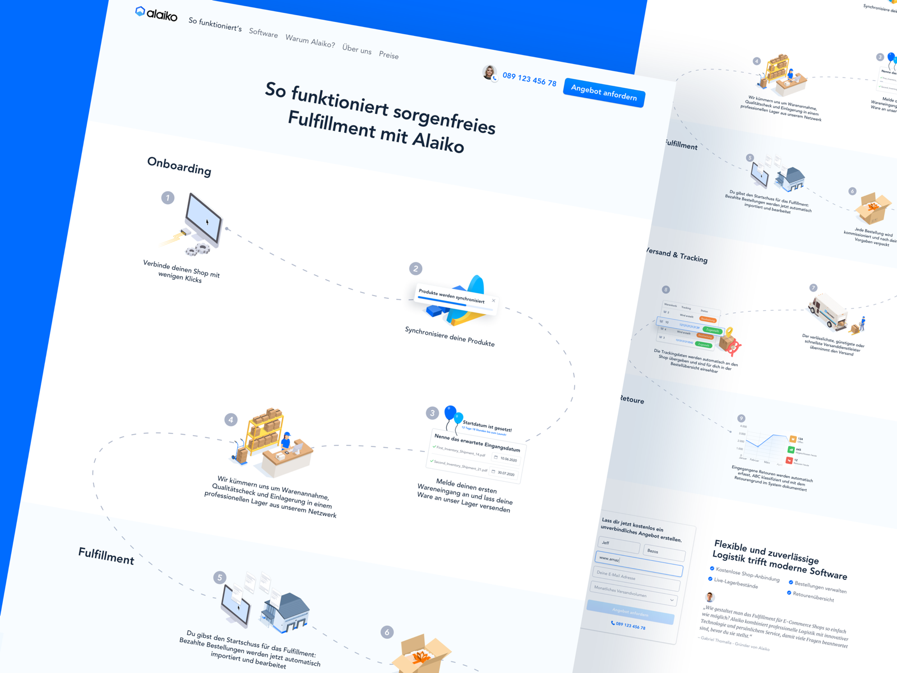
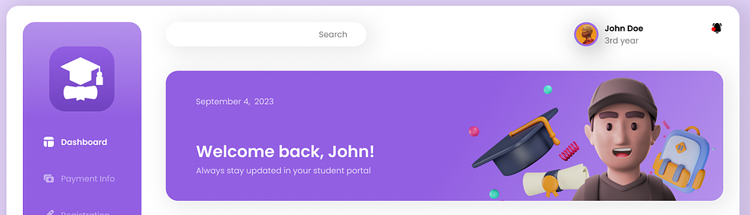

<h1 align="center">5. Sports Facility Booking Platform</h1>

<h3 align="center">⚠️ Read the entire requirement thoroughly. Every detail must be carefully reviewed from start to finish.</h3>

---

**Objective:** The goal of this assignment is to integrate the frontend with the backend system developed in **Assignment 3**, which is a sports facility booking platform. You may update your backend as needed for the frontend implementation. This integration will involve creating a fully functional user interface that communicates with the backend via API calls. Additionally, you'll need to add both a user dashboard and an admin dashboard, ensuring a smooth and user-friendly experience for booking sports facilities.

* * *

# Detailed Requirements:

## Main Requirements:

### 1\. **Landing Page:**

*   **Purpose:** Acts as the gateway to the platform, offering a general overview and guiding users to specific actions like booking a facility or logging in.
*   **Components:**
    *   **Header:** Includes logo, navigation menu, and login/registration buttons.
    *   **Hero Section:** A visually appealing banner with a brief introduction and a "Book Now" call-to-action button.
    *   **Featured Facilities:** Showcase a selection of popular facilities with images, names, and a brief description.
    *   **How It Works:** A step-by-step guide explaining the booking process. The "How It Works" section on the landing page is designed to provide users with a clear and straightforward guide to the booking process on the platform. This section breaks down the process into simple, actionable steps to ensure users understand how to make the most of the platform's features.
    
        **Here the example design:**    
        
         

        *This design is just a concept. Please use it as inspiration and apply your own creative ideas.*

    *   **Customer Testimonials:** A slider showcasing feedback from users who have successfully booked and used the facilities. You can implement this using static JSON data or develop an API to fetch and display dynamic data.
    *   **Add One Unique Section:** Showcase your creativity by adding a unique component related to the project.
    *   **Footer:** Contains links to the About Us, Contact Us, and social media pages.

### 2\. **Dashboard:**

*   **User Dashboard:**
    *   **Purpose:** Allows users to manage their bookings, and access personalized content.
    *   **Components:**
        *   **Welcome Message:** Personalized greeting. **To retrieve user information, develop an API to fetch user data from the database.** 
               
            **Here the example design:** 
               
                
             
            *This design is just a concept. Please use it as inspiration and apply your own creative ideas.*     

        *   **My Bookings:** List of bookings with options to view details, or cancel.
*   **Admin Dashboard:**
    *   **Purpose:** Provides administrators with tools to manage facilities, bookings, and users.
    *   **Components:**
        *   **Welcome Message:** Personalized greeting. **To retrieve user information, develop an API to fetch user data from the database.** 
               
            **Here the example design:** 
               
                
             
            *This design is just a concept. Please use it as inspiration and apply your own creative ideas.*     

        *   **Facility Management:** Administrators can perform CRUD operations on sports facilities, including adding new facilities, editing existing details, and removing facilities. In backend, the facility model should be updated to include an "image" field. For image uploads, you can use services like Imgbb, Cloudinary, or static image links.
        *   **Booking Management:** View all bookings.
        *   **Add Admin:** In this section, an admin can create a new admin account. The form includes fields for the following details: name, email, password, phone number, role (automatically set to "admin"), and address. (Just like sign up process)
        
### 3\. **Login/Registration Page:**

*   **Purpose:** Allows users to access their accounts or create a new account.
*   **Components:**
    *   **Login Form:** Email and password fields.
    *   **Registration Form:** Fields for name, email, password, phone, role (automatically set to "user"), address and confirmation with a "Sign Up" button.
    *   **Social Login:** Option to log in or register using social media accounts (optional).
    *   **Error Handling:** Clear error messages for invalid credentials or registration errors.

### 4\. **About Us Page:**

*   **Purpose:** Provides information about the organization behind the platform.
*   **Components:**
    *   **Mission Statement:** A brief description of the platform's purpose and values.
    *   **Team Section:** Photos and bios of key team members.
    *   **History & Milestones:** Timeline or narrative of the organization's journey and achievements.
    *   **Contact Information:** Office address, phone number, and email.

### 5\. **Contact Us Page:**

*   **Purpose:** Allows users to get in touch with support or provide feedback.
*   **Components:**
    *   **Contact Form:** Fields for name, email, subject, and message, with a "Submit" button.
    *   **Map Integration:** An embedded map showing the office location (optional).
    *   **Contact Details:** Phone number, email, and physical address.

### 6\. **Facility Listing Page:**

*   **Purpose:** Displays a list of all available(based on isDeleted = false) sports facilities .
*   **Components:**
    *   **Search & Filters:** Options to search by facility name or location, and filters for pricing. (Frontend implementation)
    *   **Facility Cards:** Each card includes an image, name, price per hour, and a "View Details" button that navigates to the facility details page.

### 7\. **Facility Details Page:**

*   **Purpose:** Provides detailed information about a specific sports facility.
*   **Components:**
    *   **Facility Overview:** Images, name, location, price, and description.
    *   **Booking Button:** A "Book Now" button that navigates to the booking page.

### 8\. **Booking Page:**

*   **Purpose:** The Booking Page serves as the interface where users can book a specific facility and check its availability. It guides the user through selecting a facility, checking available time slots, filling out booking details, and completing the booking process,  including payment.
*   **Components:**
    *   **Backend Update:** Update the logic to filter availability based on both the **date** and **facility** parameters in the `/api/check-availability` endpoint. **Add the `facility` query parameter to this endpoint.** Example endpoint: `GET /api/check-availability?date=2024-06-15&facility=jdw34iehdskedkoe3`
        
        The `/api/check-availability` endpoint will now filter available time slots based on both the **date** (in YYYY-MM-DD format) and the **facility ID**. The backend will validate these inputs and return the available slots for that date and facility. If no slots are available, it will return a message indicating this; if the input is invalid, it will return an error message. This makes checking availability more accurate.
    *   **Facility Overview:** Show the key details of the selected facility.
    *   **Availability Checker:**
        * **Description:** This is an interactive interface where users can select a date and check the availability of time slots for booking the chosen facility.
        * **UI Elements:**
            * Date Picker: An intuitive calendar control for selecting the desired booking date.
            * Check Availability Button: A button that triggers the availability check for the selected date and facility.
            * Availability Display: A section that shows available time slots after the check is performed.
    *   **Booking Form:** Fields for booking details (e.g., date, startTime and endTime).
    *   **Payment Integration:** Integration with SSL Commerz/AmarPay for secure payment processing.
    *   **Confirmation:** Display a booking summary after successful booking.
        
    **Here the example design:** 
       
        
     
    *This design is just a concept. Please use it as inspiration and apply your own creative ideas.*     

### 9\. **Error Pages**

*   **Features:** Custom 404 page for when a user navigates to a non-existent route.
*   Custom error messages for unauthorized access (e.g., trying to access admin pages as a regular user).
*   **Functionality:** Navigation options to guide users back to a safe page (e.g., Home, Login).

### **10\. UI/UX:**

*   **Design Principles:** Implement a clean, modern design with consistent color schemes and typography.
*   **User Experience:**  sure smooth navigation, intuitive controls, and accessibility considerations.
*   **Responsiveness:** Ensure the website is fully responsive on mobile, tablet, and desktop devices.

## Bonus Requirements

1. **Scroll to Top Button**  
   Implement a "Scroll to Top" button that becomes visible when users scroll down the page. This button should be easily accessible, allowing users to quickly return to the top of the page with a single click, enhancing navigation and the overall user experience.

2. **Pagination**  
   Add pagination to the "Facility Listing" page to improve user experience by breaking down content into manageable sections, making it easier for users to browse through facilities.

3. **Error Handling**  
   Implement consistent error message displays for any API failures using Toast notifications. Ensure that validation error messages are displayed directly on the relevant form fields for better user feedback.

4. **GitHub Contributions**  
   Maintain a well-documented GitHub repository with at least 15 meaningful commits. Each commit should reflect significant progress, such as feature implementation, bug fixes, or UI enhancements.

5. **Professional README File**  
   Ensure thorough documentation is available. This should encompass detailed instructions for project setup and execution, alongside pertinent details.  **For a structured guide, refer to the [Project README File Template](./Project%20Documentation%20Template.md). Please adhere to this template or follow the [Markdown Syntax Guide](./Markdown%20Syntax%20Guide.md).**

---

### Deliverables:

*   Fully functional frontend application connected to the backend system.
*   Implementation of all the pages listed above with responsive design.
*   User and Admin dashboards with the features described.
*   Complete integration of the booking system with the backend.
*   The frontend must interact seamlessly with the backend.
*   The UI/UX design should be user-friendly, intuitive, and responsive.
*   Code should be clean, well-organized, and documented.
*   Creative and effective solutions to any challenges faced during the integration process.

###   
**[ N.B: If you need to add or update anything in the backend of Assignment-3 to meet the above requirements, feel free to do so. ]**
###
