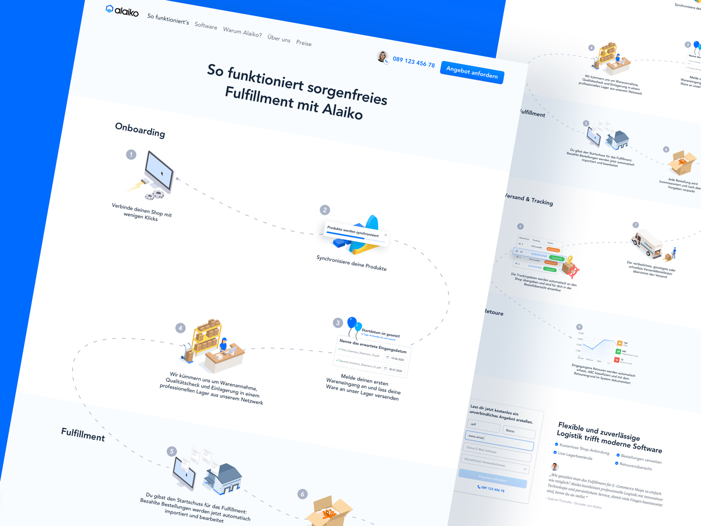

# 5 Sports Facility Booking Platform

**Objective:** The objective of this assignment is to integrate the frontend with the backend system developed in **Assignment 3**. The platform is a sports facility booking system. This integration will require the creation of a fully functional user interface that interacts with the backend through API calls. The assignment also involves adding a user dashboard and an admin dashboard and creating a seamless, user-friendly experience for booking sports facilities.

* * *

### Detailed Requirements:

#### 1\. **Landing Page:**

*   **Purpose:** Acts as the gateway to the platform, offering a general overview and guiding users to specific actions like booking a facility or logging in.
*   **Components:**
    *   **Header:** Includes logo, navigation menu, and login/registration buttons.
    *   **Hero Section:** A visually appealing banner with a brief introduction and a "Book Now" call-to-action button.
    *   **Featured Facilities:** Showcase a selection of popular facilities with images, names, and a brief description.
    *   **How It Works:** A step-by-step guide explaining the booking process. The "How It Works" section on the landing page is designed to provide users with a clear and straightforward guide to the booking process on the platform. This section breaks down the process into simple, actionable steps to ensure users understand how to make the most of the platform's features.
    
        **Here the example design:**    
        
         

        **This design is just a concept. Please use it as inspiration and apply your own creative ideas.**

    *   **Customer Testimonials:** A slider showcasing feedback from users who have successfully booked and used the facilities. You can implement this using static JSON data or develop an API to fetch and display dynamic data.
    *   **Add One Unique Section:** Showcase your creativity by adding a unique component related to the project.
    *   **Footer:** Contains links to the About Us, Contact Us, and social media pages.

#### 2\. **Dashboard:**

*   **User Dashboard:**
    *   **Purpose:** Allows users to manage their bookings, update their profiles, and access personalized content.
    *   **Components:**
        *   **Welcome Message:** Personalized greeting with user’s name.
        *   **My Bookings:** List of bookings with options to view details, or cancel.
*   **Admin Dashboard:**
    *   **Purpose:** Provides administrators with tools to manage facilities, bookings, and users.
    *   **Components:**
        *   **Facility Management:** Administrators can perform CRUD operations on sports facilities, including adding new facilities, editing existing details, and removing facilities. In backend, the facility model should be updated to include an image field. For image uploads, you can use services like Imgbb, Cloudinary, or static image links.
        *   **Booking Management:** View all bookings.
        *   **Add Admin:** In this section, an admin can create a new admin account. The form includes fields for the following details: name, email, password, phone number, role (automatically set to "admin"), and address. (Just like sign up process)
        *   **Reports & Analytics:** Dashboard widgets displaying statistics such as total bookings, revenue, and user engagement. This can be implemented using static JSON data or by developing an API to provide dynamic data.
  
            **Here the example design:** 
               
                
             
            **This design is just a concept. Please use it as inspiration and apply your own creative ideas.**

#### 3\. **Login/Registration Page:**

*   **Purpose:** Allows users to access their accounts or create a new account.
*   **Components:**
    *   **Login Form:** Email and password fields with a "Remember Me" checkbox and a "Forgot Password?" link.
    *   **Registration Form:** Fields for name, email, password, phone, role (automatically set to "user"), address and confirmation with a "Sign Up" button.
    *   **Social Login:** Option to log in or register using social media accounts (optional).
    *   **Error Handling:** Clear error messages for invalid credentials or registration errors.

#### 4\. **About Us Page:**

*   **Purpose:** Provides information about the organization behind the platform.
*   **Components:**
    *   **Mission Statement:** A brief description of the platform's purpose and values.
    *   **Team Section:** Photos and bios of key team members.
    *   **History & Milestones:** Timeline or narrative of the organization's journey and achievements.
    *   **Contact Information:** Office address, phone number, and email.

#### 5\. **Contact Us Page:**

*   **Purpose:** Allows users to get in touch with support or provide feedback.
*   **Components:**
    *   **Contact Form:** Fields for name, email, subject, and message, with a "Submit" button.
    *   **Map Integration:** An embedded map showing the office location (optional).
    *   **Contact Details:** Phone number, email, and physical address.

#### 6\. **Facility Listing Page:**

*   **Purpose:** Displays a list of all available(based on isDeleted) sports facilities .
*   **Components:**
    *   **Search & Filters:** Options to search by facility name or location, and filters for pricing. (Frontend implementation)
    *   **Facility Cards:** Each card includes an image, name, price per hour, and a "View Details" button.

#### 7\. **Facility Details Page:**

*   **Purpose:** Provides detailed information about a specific sports facility.
*   **Components:**
    *   **Facility Overview:** Images, name, location, price, and description.
    *   **Booking Button:** A "Book Now" button that navigates to the booking page.

#### 8\. **Booking Page:**

*   **Purpose:** Allows users to book a facility and check availability.
*   **Components:**
    *   **Facility Overview:** Reiterate key details of the selected facility.
    *   **Availability Checker:** Interface to select a date, and check the availability of time slots for booking on a specific date.
    *   **Booking Form:** Fields for booking details (e.g., date, startTime and endTime).
    *   **Payment Integration:** Integration with stripe for secure payment processing (optional).
    *   **Confirmation:** Display a booking summary after successful booking.

### 9\. **Error Pages**

*   **Features:** Custom 404 page for when a user navigates to a non-existent route.
*   Custom error messages for unauthorized access (e.g., trying to access admin pages as a regular user).
*   **Functionality:** Navigation options to guide users back to a safe page (e.g., Home, Login).

#### **10\. UI/UX:**

**UI/UX Quality:**

*   **Design Principles:**
    *   Implement a clean, modern design with consistent color schemes and typography.
*   **User Experience:**
    *   Ensure smooth navigation, intuitive controls, and accessibility considerations.

**Responsiveness:**

*   **Cross-Device Compatibility:**
    *   Ensure the website is fully responsive on mobile, tablet, and desktop devices.

  

* * *

### Deliverables:

*   Fully functional frontend application connected to the backend system.
*   Implementation of all the pages listed above with responsive design.
*   User and Admin dashboards with the features described.
*   Complete integration of the booking system with the backend.
*   The frontend must interact seamlessly with the backend.
*   The UI/UX design should be user-friendly, intuitive, and responsive.
*   Code should be clean, well-organized, and documented.
*   Creative and effective solutions to any challenges faced during the integration process.

###   

###