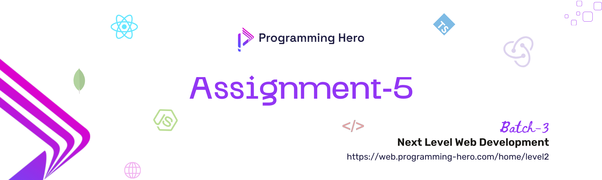

Welcome to Assignment 5! 🎉 In this assignment, your primary objective is to integrate the frontend with the backend system developed in **Assignment 3**. This assignment will challenge you to connect the user interface with the backend functionalities, ensuring a seamless flow of data and interaction between the client and server.

## 🛠️ Technology You Can Use

- **Frontend Development:**
  - React 
  - Redux
  - TypeScript 

- **Package Management:**
  - Any npm packages that are required for your project 

- **Additional Technologies:**
  - Feel free to incorporate any additional technologies that you deem necessary for your project 

---

## 🔗 Objective

The goal of this assignment is to build a fully functional web application by integrating a frontend with the backend system created in Assignment 3. This involves:

- **Connecting your frontend** to the existing backend APIs. 
- **Implementing user and admin dashboards** with real-time data. 
- **Ensuring smooth interaction** and data flow between the frontend and backend systems. 
- **Applying UI/UX principles** to create a user-friendly interface. 

## 🔗 Key Tasks

1. **Frontend Integration**: Connect the frontend with the backend endpoints to enable data retrieval, submission, and interaction. 
2. **Dashboard Implementation**: Develop user and admin dashboards that display relevant data and analytics. 
3. **UI/UX Design**: Design a clean, intuitive, and responsive user interface to enhance the user experience. 
4. **Error Handling**: Implement proper error handling to manage and display errors gracefully. 
5. **Testing**: Test the integration thoroughly to ensure that all functionalities work as expected. 

## ⚙️ Guidelines

- **Plagiarism Not Allowed**: Your submission must be your own work. Plagiarism will result in a score of 0. 
- **Meaningful Variable Names**: Use clear and descriptive variable names to improve code readability. 
- **Code Commenting**: Add comments to explain the purpose of your code sections and important logic. This will help others (and yourself) understand your code better. 
- **User Experience and Interface**: Prioritize a better user experience (UX) and user interface (UI). Make your application intuitive, easy to use, and visually appealing.  **The UI/UX section is worth 7 marks.**
- **Consistent Code Style**: Maintain a consistent coding style throughout the project. Follow best practices and coding standards for the technologies you are using. 
- **Error Handling**: Implement proper error handling for both frontend and backend to ensure a smooth user experience. 
- **Responsive Design**: Ensure that your application is responsive and works well on different screen sizes and devices. 
- **Documentation**: Ensure thorough documentation is available. This should encompass detailed instructions for project setup and execution, alongside pertinent details.  **For a structured guide, refer to the [Project README File Template](./Project%20Documentation%20Template.md). Please adhere to this template or follow the [Markdown Syntax Guide](./Markdown%20Syntax%20Guide.md).**
- **Version Control**: Use version control (e.g., Git) effectively. Commit your changes regularly with meaningful commit messages. 
- **Deployment**: Ensure that your application is deployed and accessible via the provided live deployment links. Test the deployment to ensure it works as expected. 

### 📤 Submission Guidelines

- **Submit a well-documented codebase** with clear comments. 
- **Add a README file** that explains how to set up and use the application. In the README, include details like the project name, live URL, features, technology used, and other important information. Make it look professional by doing some research and making it appealing. 

### 📤 What You Need to Provide

1. **Live Deployment Link (Server and Client)** 
2. **GitHub Repository Links (Server and Client)** 
3. **Project Overview Video** (A brief video providing an overview of the project)
4. **Admin credentials and other credentials if necessary**

## 🔢 Assignment Number Based on the Last Digit of PH Student ID

| Last Digit of PH Student ID | Assignment Number (Design No)                                                                                                  |
| --------------------------- | ------------------------------------------------------------------------------------------------------------------------------ |
| 0, 1                        | [1. Car Wash Booking System](./1-%20Car%20Wash%20Booking%20System.md)                                                          |
| 2, 3                        | [2. Meeting Room Booking System for Co-working spaces](/#2%20Meeting%20Room%20Booking%20System%20for%20Co-working%20spaces.md) |
| 4, 5                        | [3. Car Rental Reservation System](./#3%20Car%20Rental%20Reservation%20System.md)                                              |
| 6, 7                        | [4. Bike Rental Service Website](./#4%20Bike%20Rental%20Service%20Website.md)                                                  |
| 8, 9                        | [5. Sports Facility Booking Platform](./5-%20Sports%20Facility%20Booking%20Platform.md)                                        |

### ⏰ **Deadline:**

- 60 Marks: 29th August ⏳
- 50 Marks: 30th August ⌛

***Note: The deadlines are final and will not be extended.***

## 🚫 **Important Note:**

Plagiarism will not be tolerated. Ensure that the code you submit is your work. Any instances of plagiarism will result in 0 Marks ❌.

---

By following these instructions, you'll be well-equipped to complete Assignment 5 successfully. Good luck! 🍀
